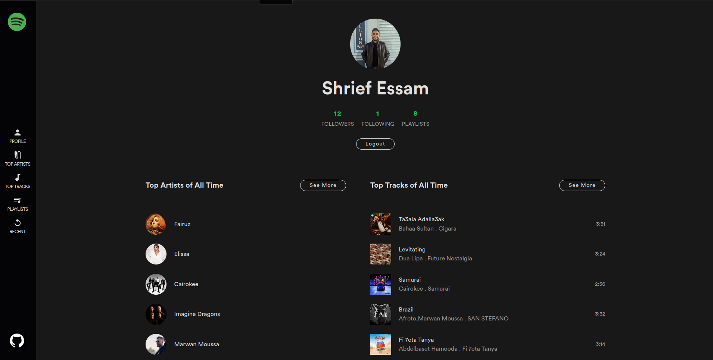
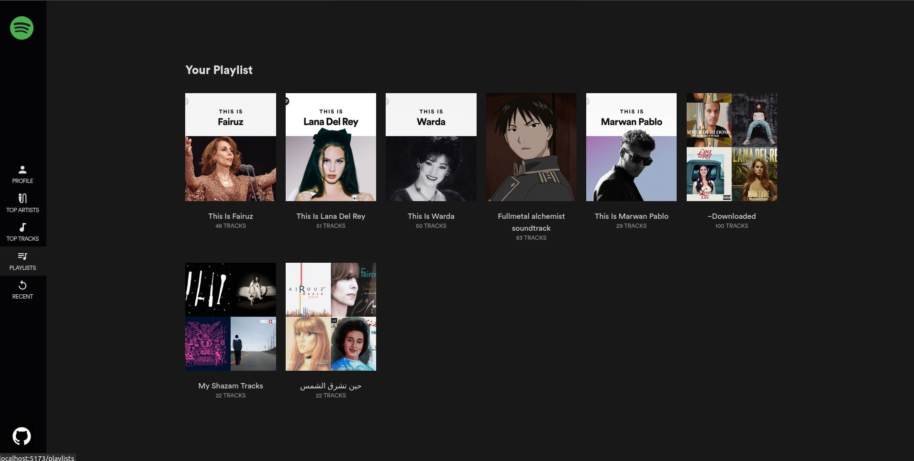
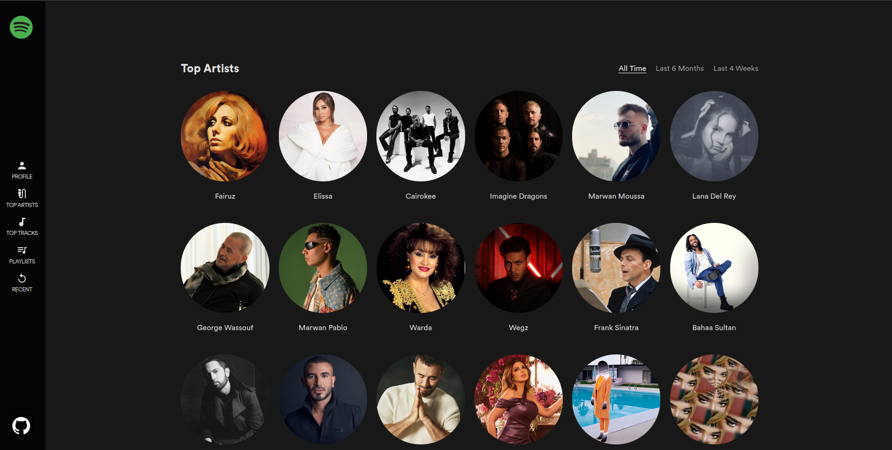
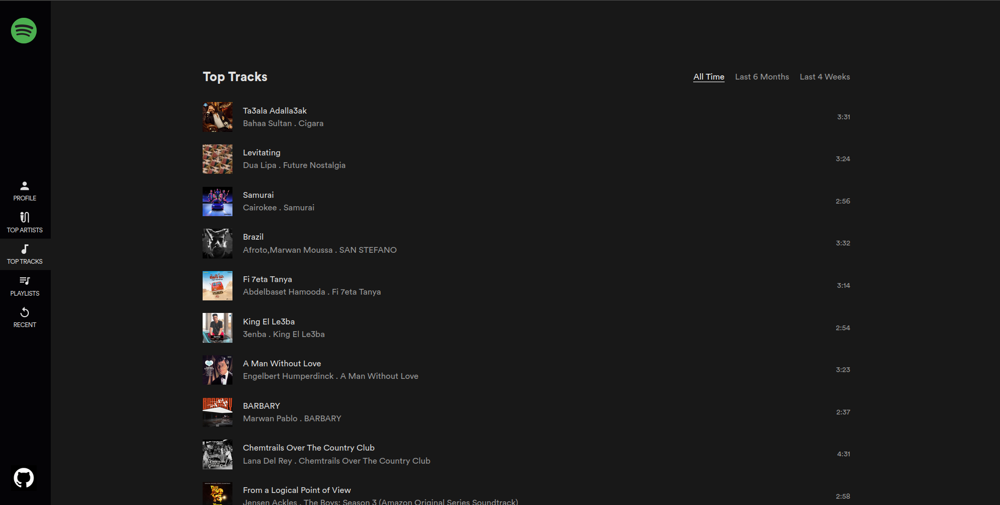

# spotify_client
A web app for visualizing personalized Spotify data using Node and React.

Built with a bunch of things, but to name a few:

- [Spotify Web API](https://developer.spotify.com/documentation/web-api/)
- [Vite](https://vitejs.dev/)
- [Express](https://expressjs.com/)
- [Reach Router](https://reach.tech/router)
- [Tailwind](https://tailwindcss.com/)

## Setup

1. [Register a Spotify App](https://developer.spotify.com/dashboard/applications) and add `http://localhost:3000/callback` as a Redirect URI in the app settings
1. Create an `.env` file in the root of the project based on `.env.example`
1. `nvm use`
1. `yarn && yarn client:install`
1. `yarn dev

## Screenshots 

